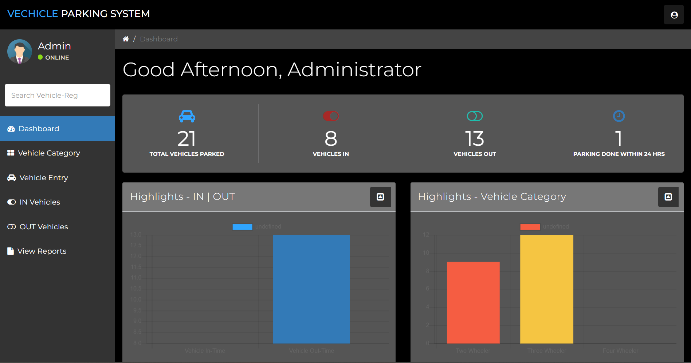
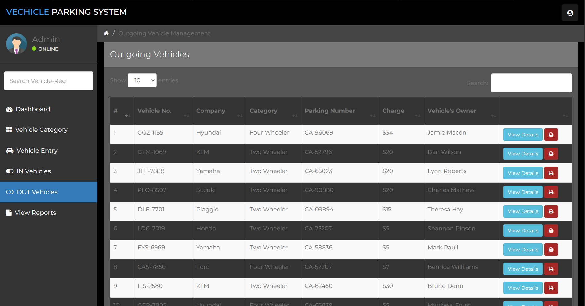
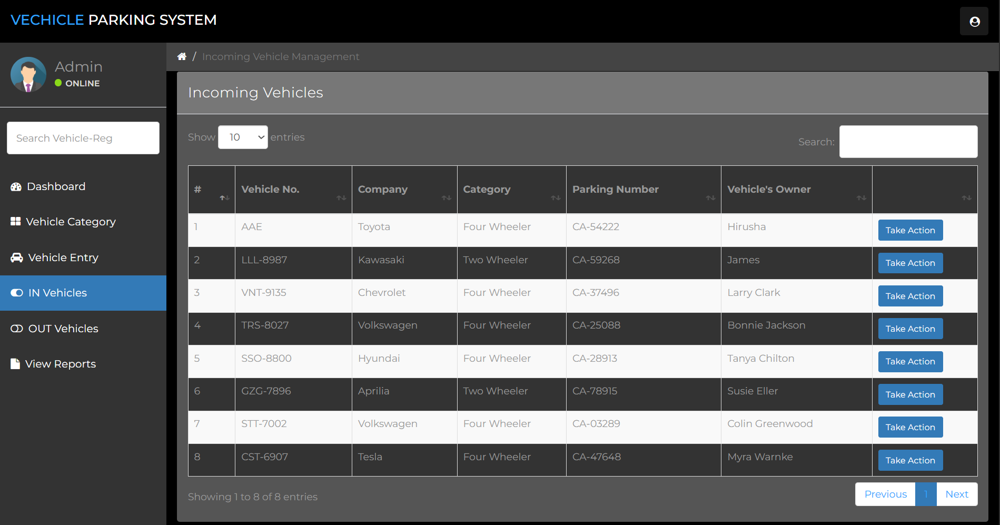

# 🚗 Vehicle Parking Management System

## 📌 Overview

The **Vehicle Parking Management System** is a web-based application developed to manage vehicle entry, exit, and parking records efficiently.

It helps administrators:
- Track incoming and outgoing vehicles  
- Manage parking categories  
- Generate reports and income details  
- Maintain a secure and organized parking system  

The system is built using **PHP, MySQL, HTML, CSS, and JavaScript** and runs on a **local server (XAMPP)**.

---

## 🎯 Features

- 🚘 Add incoming vehicles  
- 🚪 Manage outgoing vehicles  
- 📂 Vehicle category management  
- 🔍 Search vehicle records  
- 📊 Generate reports  
- 💰 Track total income  
- 🔐 Admin authentication (login/logout)  
- ⚙️ Profile & password management  

---

## 🛠️ Technologies Used

- **Frontend:** HTML, CSS, JavaScript  
- **Backend:** PHP  
- **Database:** MySQL  
- **Server:** XAMPP / Localhost  

---

## 🗄️ Database Details

- **Database Name:** `vehicle-parking-db`

---

## 🔐 Admin Login

- **Username:** `admin`  
- **Password:** `Password@123`

---

## 📸 Screenshots

### 📊 Dashboard

### 🚘 Incoming Vehicles

### 🚪 Outgoing Vehicles

---

## 🚀 How to Run the Project

1. Install **XAMPP**
2. Move the project folder to:

C:/xampp/htdocs/

3. Start:
- Apache  
- MySQL  

4. Import the database:
- Open **phpMyAdmin**
- Create database: `vehicle-parking-db`
- Import the `.sql` file  

5. Open browser:

http://localhost/your-folder-name

6. Login using admin credentials  

---

## 🔮 Future Improvements

- 🔐 Role-based authentication (Admin/User)  
- 📱 Mobile responsive UI  
- 🔔 Notification system  
- ☁️ Cloud database integration  
- 📊 Advanced analytics dashboard  

---

## 👨‍💻 Author

**Ashoka B Chandrasiri**  
Data Science Student
